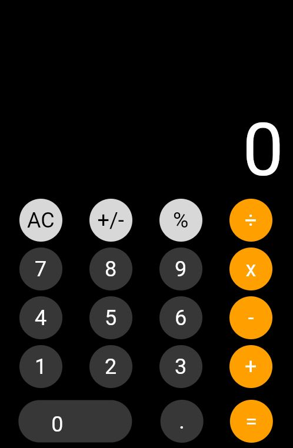
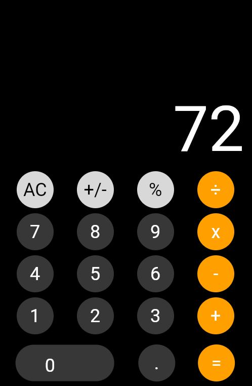

# iPhone Calculator Clone App


## Overview

  

This is a simple iPhone calculator app developed using Flutter, designed to resemble the default calculator app found on iPhones. The app provides basic arithmetic operations and a clean user interface to make calculations easy and intuitive.

  

## Features

  

- Addition, subtraction, multiplication, and division operations.

- Support for decimals and negative numbers.

- A keyboard sound same as iOS Calculator

- Given slightly different sound to some buttons for recognizing different buttons.

- Smooth and responsive user interface.

  

## Screenshots

<p align="center">
  
  
</p>
  

## Installation

  

To run the app on your device, follow these steps:

  

1. Ensure you have Flutter installed on your computer. If not, follow the official Flutter installation guide: [Flutter Installation Guide](https://flutter.dev/docs/get-started/install)

  

2. Clone this repository or download the ZIP file and extract it to a location of your choice.

  

3. Open the project in your favorite code editor (e.g., Visual Studio Code).

  

4. Connect your Android or iOS device to your computer / use virtual device.

  

5. Run the following command in the terminal to install the required dependencies:

  

```bash

flutter pub get
```
6. Run the main.dart file and get your iPhone calculator is ready!
  ## Usage

-   Launch the app on your device.
-   Use the buttons to input the numbers and select the desired arithmetic operation.
-   Press the equal (=) button to calculate the result.
-   To perform another calculation, use the clear (AC) button to reset the current calculation.

## Contribution

Contributions to this project are welcome. If you encounter any bugs, have suggestions, or want to add new features, please create a pull request. Please ensure that your code follows Flutter's best practices and includes appropriate documentation.

## License

This project is licensed under the MIT License.

## Contact

For any inquiries or feedback, please contact the project maintainer:

Your Name Email: [rajchaudhari2528@gmail.com](https://mail.google.com/mail/u/0/?fs=1&tf=cm&source=mailto&to=rajchaudhari2528@gmail.com) 
LinkedIn: [Prasad Chaudhari](https://www.linkedin.com/in/prasad-chaudhari-45b975228/)

Feel free to reach out for any questions or collaborations.

---------

Thank you for using the iPhone Calculator Clone Flutter App! We hope it simplifies your calculations and provides a delightful user experience. If you enjoy using the app, consider giving it a star on GitHub and sharing it with your friends. Happy calculating! 🧮

--------

A few resources to get you started if this is your first Flutter project:

- [Lab: Write your first Flutter app](https://flutter.dev/docs/get-started/codelab)

- [Cookbook: Useful Flutter samples](https://flutter.dev/docs/cookbook)

  

For help getting started with Flutter, view our

[online documentation](https://flutter.dev/docs), which offers tutorials,

samples, guidance on mobile development, and a full API reference.
